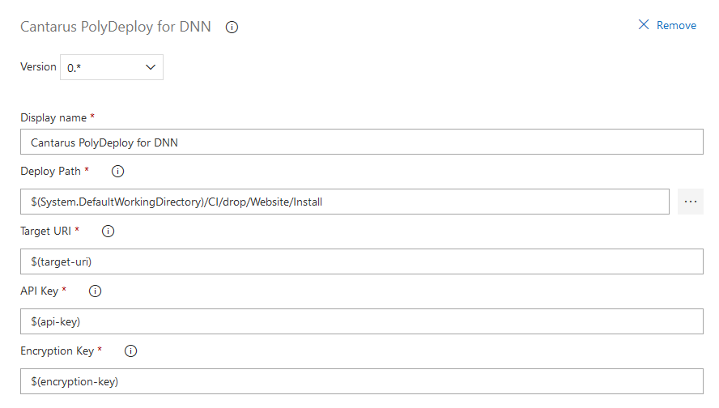

# Cantarus PolyDeploy Client for Azure DevOps

[Cantarus PolyDeploy](https://www.cantarus.com/polydeploy) is a component to
easily install extensions into a DNN website, and this task allows you to
automate that installation using Azure Pipelines.

To get started, you need to create an API user within the PolyDeploy module.
You'll want to make sure to check the box to allow the user to bypass the IP
whitelist if you're using Azure Pipelines, since the pipeline agent won't have a
predictable IP address.  Once the user is created, setup
[custom variables](https://docs.microsoft.com/en-us/azure/devops/pipelines/release/variables#custom-variables)
for the user's API Key and Encryption Key.

When adding the task to a pipeline, you'll fill in the variables into the task's
configuration.  Set the _Target URI_ to the root URL of the website (e.g.
https://example.com), and set the _Deploy Path_ to the folder with your packages
to install.  The task will automatically find any `*.zip` files in that folder
and its subfolders and pass them to the PolyDeploy client to be installed.

This version of the task includes version 0.8.0 of the PolyDeploy client.

This Azure DevOps task is a project of [Engage Software](https://engagesoftware.com/).
